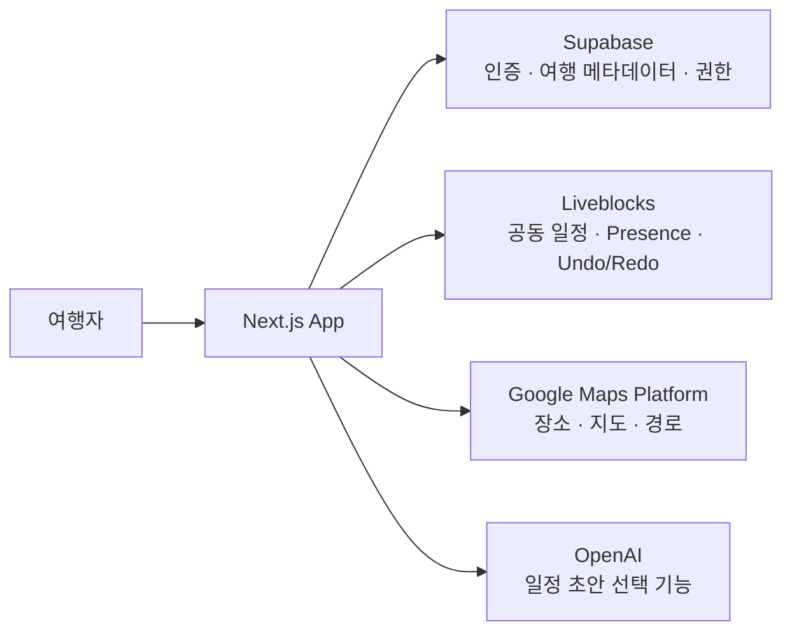

<div align="center">

# TripMate

### 함께 계획하고, 같은 여행을 기대하는 방법

친구들과 한 화면에서 일정을 만들고, 장소·준비물·공동 경비까지 정리하는<br />
**실시간 협업 여행 플래너**

[](https://tripmate-xi-six.vercel.app)
[](https://nextjs.org/)
[](https://www.typescriptlang.org/)
[](https://github.com/ddoniddoni/tripmate)

[서비스 열기](https://tripmate-xi-six.vercel.app) · [개발 포트폴리오](docs/PORTFOLIO.md) · [기능 살펴보기](#핵심-경험)

</div>

---

## 여행 계획의 대화가, 실제 일정이 되기까지

여행 준비는 보통 단체 채팅방에서 시작하지만, 맛집 링크와 의견은 금세 흩어집니다.
TripMate는 **장소를 찾고, 일정으로 옮기고, 함께 조정하는 과정**을 하나의 여행판에 담았습니다.

<table>
  <tr>
    <td width="33%" align="center"><strong>📍 발견</strong><br /><sub>가고 싶은 장소를 찾고 후보로 남겨요.</sub></td>
    <td width="33%" align="center"><strong>🗓️ 설계</strong><br /><sub>날짜와 시간에 맞춰 하루의 흐름을 만들어요.</sub></td>
    <td width="33%" align="center"><strong>🤝 완성</strong><br /><sub>친구들과 같은 계획을 보며 함께 결정해요.</sub></td>
  </tr>
</table>

## 핵심 경험

| 여행을 준비하는 순간 | TripMate가 하는 일 |
| --- | --- |
| **“여기 가보고 싶어.”** | Google Places 검색으로 장소를 찾고, 주소·좌표가 포함된 일정 카드로 추가합니다. |
| **“이건 둘째 날이 더 낫겠다.”** | 드래그 앤 드롭으로 같은 날 안에서 순서를 바꾸거나 다른 날짜로 이동합니다. |
| **“동선이 괜찮을까?”** | 타임라인 선택과 지도 마커를 양방향으로 연결하고, 확정된 순서로 이동 경로를 표시합니다. |
| **“같이 정하자.”** | 가입된 계정을 편집자·보기 전용으로 초대하고, 알림에서 수락·거절한 뒤 함께 계획합니다. |
| **“출발 전에 뭐 챙기지?”** | 담당자와 상태를 갖춘 준비물 체크리스트, 공동 경비와 정산 가이드를 한곳에서 관리합니다. |

### 계획을 바꿔도 불안하지 않게

- 일정 추가·수정·복제·삭제와 날짜 간 이동
- 변경 한 번을 한 단계로 되돌리는 Undo / Redo
- 겹치는 일정과 이동 시간에 대한 비차단 안내
- 연결 중·재연결 중·오프라인·읽기 전용 상태를 분명하게 표시
- 데스크톱 3열 편집 화면과 모바일 친화적 화면 전환
- 선택한 테마를 기억하는 라이트 / 다크 모드

### AI로 시작하고, 팀과 완성하기

여행지와 취향을 바탕으로 AI가 하루별 동선 초안을 제안합니다. 초안은 정답이 아니라 출발점입니다. 장소 검색, 시간 조정, 팀원의 의견으로 실제 여행에 맞는 일정으로 다듬을 수 있습니다.

## 1분 사용 흐름

```text
이메일·비밀번호 회원가입 / 로그인
        ↓
여행 이름 · 기간 · 목적지로 여행판 생성
        ↓
장소 검색 → 날짜별 일정에 추가 → 드래그로 순서 조정
        ↓
지도와 이동 경로로 동선 확인
        ↓
계정 초대 → 알림에서 수락 → 준비물 · 공동 경비까지 함께 정리
```

## 어떻게 함께 동작하나요?



| 영역 | 역할 |
| --- | --- |
| **Supabase** | 이메일·비밀번호 인증, 여행·멤버십·초대 데이터, Row Level Security 기반 권한 관리 |
| **Liveblocks** | 여러 사람이 동시에 다루는 일정·준비물·경비 상태와 접속 상태, 변경 이력 |
| **Google Maps Platform** | 장소 검색·상세 정보, 지도 렌더링, 일정 순서 기반 경로 계산 |
| **OpenAI** | 선택적으로 사용하는 여행 동선 초안 생성 |

## 기술 스택

| 분야 | 사용 기술 |
| --- | --- |
| Framework | Next.js 16 App Router, React 19, TypeScript |
| UI | CSS, Radix UI, Pretendard |
| Form & Validation | React Hook Form, Zod |
| Drag & Drop | dnd-kit |
| Collaboration | Liveblocks Storage, Presence, History |
| Authentication & Data | Supabase SSR, PostgreSQL, RLS |
| Maps | Google Maps JavaScript API, Places API (New), Routes API |
| Testing | Vitest, React Testing Library, Playwright |
| Deployment | Vercel |

## 프로젝트 구조

```text
src/
├── app/        # 라우트, 레이아웃, Route Handler
├── features/   # 일정 편집, 지도, 협업, 공유, 경비 등 사용자 기능
├── entities/   # Trip, Itinerary, Place 등 도메인 모델과 규칙
└── shared/     # Supabase 클라이언트, 설정, 공용 UI와 유틸리티
```

의존성은 `app → features → entities → shared` 방향을 지키며, 각 상태는 한 곳에서만 관리합니다. 자세한 설계 원칙은 [Engineering Guide](docs/TRIPMATE_ENGINEERING_GUIDE.md)를 참고하세요.

## 보안과 데이터 원칙

- 공개 클라이언트 키와 서버 권한 키를 분리해 민감한 권한이 브라우저에 노출되지 않도록 설계했습니다.
- Supabase 공개 테이블은 RLS를 사용하며, UI 표시 여부와 별개로 서버에서 멤버십·역할 권한을 확인합니다.
- 여행 초대와 개인 여행 정보는 수신자·멤버만 확인할 수 있도록 제한합니다.

---

<div align="center">

**여행 전의 대화를, 출발이 기다려지는 계획으로.**

[TripMate 시작하기](https://tripmate-xi-six.vercel.app) · [GitHub 저장소](https://github.com/ddoniddoni/tripmate)

</div>
