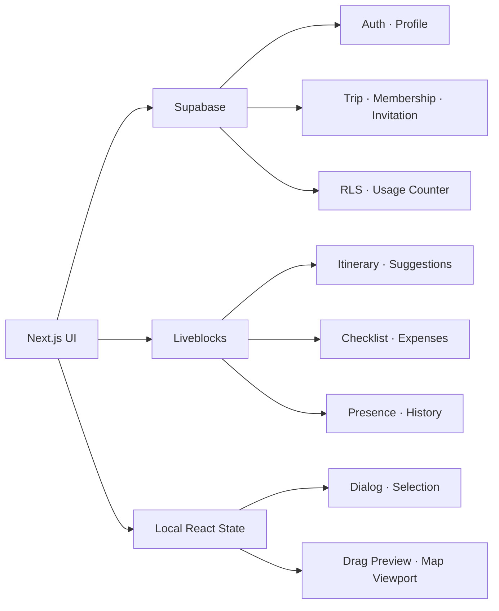
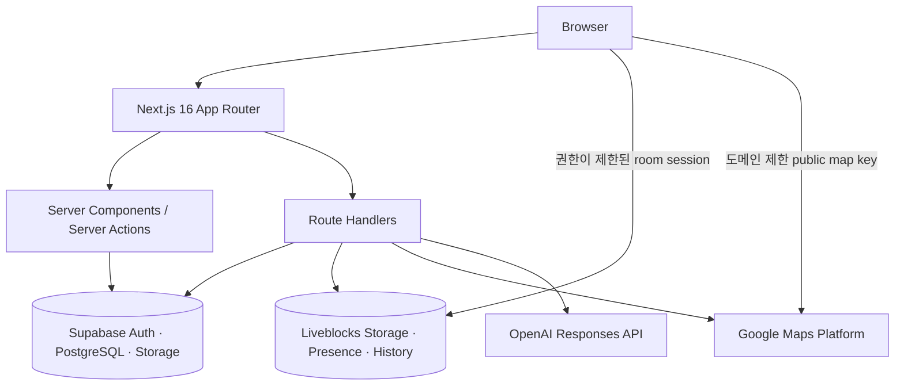

<div align="center">

# TripMate — Frontend Engineering Case Study

### 흩어진 여행 정보를, 함께 편집할 수 있는 하나의 여행판으로

일정·지도·준비물·공동 경비를 한 화면에서 관리하는<br />
**실시간 협업 여행 플래너**

[](https://tripmate-xi-six.vercel.app)
[](https://github.com/ddoniddoni/tripmate)
[](https://nextjs.org/)
[](https://www.typescriptlang.org/)

</div>

---

## 30초 요약

TripMate는 단체 채팅방에 흩어지는 장소 링크, 일정 의견, 준비물과 경비를 하나의 협업 공간으로 모은 웹 애플리케이션입니다.

이 프로젝트에서 단순한 CRUD를 넘어 다음 문제를 직접 설계하고 구현했습니다.

- 여러 사용자가 동시에 수정하는 일정의 **실시간 동기화와 Presence**
- 같은 날 정렬과 날짜 간 이동을 지원하는 **접근 가능한 Drag & Drop**
- 타임라인·지도·경로를 연결하면서 불필요한 외부 API 호출을 줄이는 **상태 및 요청 설계**
- `owner / editor / viewer` 역할을 UI가 아닌 서버와 RLS에서도 검증하는 **권한 모델**
- 인증, 초대, 외부 Provider 실패, 연결 끊김과 모바일 환경까지 고려한 **제품 수준의 예외 처리**

> 핵심 역량: 복잡한 프론트엔드 상태 설계, 실시간 협업 UX, 서버 권한 검증, 외부 API 추상화, 반응형 UI, 자동화 테스트

## 프로젝트 개요

| 항목 | 내용 |
| --- | --- |
| 프로젝트 성격 | 포트폴리오용 풀스택 웹 애플리케이션 |
| 서비스 형태 | 반응형 Web App |
| 핵심 사용자 | 친구·가족과 여행을 공동으로 계획하는 사용자 |
| 핵심 가치 | 장소 탐색부터 일정, 준비물, 경비까지 하나의 공유 여행판에서 관리 |
| 배포 | Vercel Production |
| 데이터 | Supabase PostgreSQL + Liveblocks Storage |
| 주요 외부 연동 | Google Maps Platform, Liveblocks, OpenAI Responses API |
| 자동화 검증 | Vitest 110개 파일·422개 테스트, Playwright 3개 파일·5개 시나리오 |

## 해결하려 한 문제

여행 계획은 보통 메신저에서 시작합니다. 하지만 장소 링크는 대화 사이로 사라지고, 일정표는 여러 버전으로 갈라지며, 누가 무엇을 준비하고 결제했는지 다시 확인해야 합니다.

TripMate는 이 과정을 세 가지 원칙으로 다시 설계했습니다.

1. **정보를 한곳에 모은다** — 일정, 후보 장소, 준비물, 경비를 여행 단위로 연결합니다.
2. **같은 화면을 함께 편집한다** — 변경 사항과 현재 접속 상태를 실시간으로 공유합니다.
3. **결정 과정까지 남긴다** — 후보 장소의 투표·의견, 초대 응답, 정산 상태를 명시적으로 관리합니다.

## 대표 사용자 흐름

```text
이메일·비밀번호 회원가입 → 최초 1회 이메일 확인 → 프로필 설정
        ↓
여행 이름·목적지·기간으로 여행 생성
        ↓
Google 장소 검색 → 상세 확인 → 날짜별 일정 또는 후보 장소로 추가
        ↓
Drag & Drop으로 순서·날짜 조정 → 지도와 경로로 동선 확인
        ↓
멤버 초대 → 알림에서 수락·거절 → 실시간 공동 편집
        ↓
준비물 담당·완료 상태와 공동 경비·정산 내역 관리
```

## 구현 기능

### 1. 인증과 계정

| 기능 | 구현 내용 | 지원 상태 |
| --- | --- | --- |
| 회원가입 | 이메일·비밀번호 검증, 비밀번호 확인, 이메일 인증 안내 화면 | 지원 |
| 로그인 | Supabase Password Auth, 안전한 `next` 경로 복귀 | 지원 |
| 세션 | Next.js Server Component와 Supabase SSR 쿠키 기반 세션 | 지원 |
| 프로필 | 최초 닉네임 설정, 닉네임 수정, 계정 삭제 | 지원 |
| 오류 처리 | 잘못된 자격 증명, 인증 만료, Provider 오류를 한국어 메시지로 안내 | 지원 |

### 2. 여행 관리

| 기능 | 구현 내용 | 지원 상태 |
| --- | --- | --- |
| 여행 생성 | 제목, 목적지, 시작일, 종료일 입력 및 도메인 검증 | 지원 |
| 여행 목록 | 내가 참여한 여행 카드, 일정 요약, 역할 표시 | 지원 |
| 기본/사용자 커버 | 기본 여행 이미지 또는 Supabase Storage 업로드 이미지 | 지원 |
| 여행 정보 수정 | 제목·목적지·기간 변경, 일정이 든 날짜의 손실 방지 | 지원 |
| 여행 삭제 | 소유자 권한 확인과 확인 다이얼로그 | 지원 |

여행 기간 변경은 Supabase 메타데이터와 Liveblocks 일정 문서를 함께 다뤄야 합니다. 먼저 기존 일정을 검증하고, 협업 문서 갱신이 실패하면 Supabase 변경을 되돌리는 보상 로직으로 두 저장소의 불일치를 줄였습니다.

### 3. 일정 편집

| 기능 | 구현 내용 | 지원 상태 |
| --- | --- | --- |
| 일정 CRUD | 장소, 시작 시간, 소요 시간, 메모 추가·수정·복제·삭제 | 지원 |
| 순서 편집 | 같은 날짜 안에서 Drag & Drop 또는 위·아래 버튼 이동 | 지원 |
| 날짜 간 이동 | 다른 날짜로 Drag & Drop, 위치를 지정하는 이동 다이얼로그 | 지원 |
| 날짜 단위 작업 | 하루 일정 전체 복제, 시작 시간 기준 자동 정렬 | 지원 |
| 일정 검색 | 전체 여행 일정에서 검색 후 해당 날짜와 카드로 이동 | 지원 |
| 충돌 안내 | 시간이 겹치는 일정과 이동 시간이 부족한 구간을 비차단 경고로 표시 | 지원 |
| 히스토리 | Liveblocks History 기반 Undo / Redo와 키보드 단축키 | 지원 |

Drag 중에는 공유 문서를 계속 쓰지 않습니다. Drop 시점에만 현재 문서를 다시 확인하고 하나의 도메인 mutation을 커밋해, 네트워크 쓰기와 협업 히스토리 오염을 줄였습니다.

### 4. 후보 장소와 의사결정

- Google Places 검색 결과를 정규화된 `PlaceSnapshot`으로 저장
- 장소 상세 정보 확인 후 일정 또는 후보 목록에 추가
- 후보 장소 투표와 의견 작성
- 선택된 후보를 정식 일정으로 승격
- 검색 loading, empty, error, quota 초과 상태 제공

### 5. 지도와 동선

| 기능 | 구현 내용 | 지원 상태 |
| --- | --- | --- |
| 지도 | Google Maps JavaScript API 기반 마커 렌더링 | 지원 |
| 양방향 선택 | 일정 카드 선택 시 마커 강조, 마커 선택 시 일정 카드로 이동 | 지원 |
| 이동 경로 | Google Routes API 기반 거리·예상 시간·Polyline 표시 | 지원 |
| 요청 최적화 | 좌표와 이동 수단으로 query key 생성, 동일 경로 메모리 캐시, stale 요청 취소 | 지원 |
| 테마 | 라이트·다크 테마에 맞춘 지도 스타일 | 지원 |
| 비용 보호 | 장소 검색·상세·지도·경로를 서버에서 일/월 단위로 예약하고 한도 초과 시 차단 | 지원 |

브라우저 지도 키와 서버용 Places/Routes 키를 분리했습니다. 서버 Route Handler가 로그인과 입력을 검증한 뒤에만 외부 API를 호출하며, 사용량 저장소를 확인할 수 없을 때는 요청을 허용하지 않는 fail-closed 방식을 적용했습니다.

### 6. 실시간 협업

- 일정, 후보 장소, 준비물, 공동 경비를 Liveblocks Storage에 저장
- 접속 인원, 현재 보고 있는 작업 공간, 선택한 일정 카드를 Presence로 공유
- 연결 중·동기화·재연결·연결 끊김 상태 표시
- 다른 사용자의 선택을 카드에 표시하되 내 스크롤·지도 시야는 강제로 변경하지 않음
- 협업 변경 이력을 활용한 Undo / Redo

Liveblocks 방 접속은 클라이언트가 비밀 키를 받는 방식이 아닙니다. `/api/liveblocks-auth`가 Supabase 로그인과 여행 멤버십을 확인하고, 역할에 맞는 방 권한만 발급합니다.

### 7. 초대와 권한

| 역할 | 일정·준비물·경비 편집 | 여행 정보 수정 | 멤버 관리 | 여행 삭제 |
| --- | ---: | ---: | ---: | ---: |
| Owner | 가능 | 가능 | 가능 | 가능 |
| Editor | 가능 | 불가 | 불가 | 불가 |
| Viewer | 읽기 전용 | 불가 | 불가 | 불가 |

- 가입된 사용자 이메일로 편집자 또는 보기 전용 초대
- 헤더 알림 배지와 알림함에서 초대 수락·거절
- 만료·취소·이미 처리된 초대 상태 구분
- 멤버 역할 변경, 내보내기, 초대 취소, 소유권 이전, 여행 나가기
- Supabase RLS와 보안 함수에서 수신자·멤버·소유자 권한을 재검증

### 8. 준비물과 공동 경비

- 카테고리, 우선순위, 담당자, 완료 상태를 가진 공동 준비물 체크리스트
- 지출 내용, 금액, 분류, 결제자, 정산 참여자를 가진 공동 경비 원장
- 카테고리 필터, 지출 수정·삭제, 원화 천 단위 표시
- 멤버별 부담액과 잔액 계산, 최소 송금 가이드, 송금 완료 상태
- Viewer에게는 동일 데이터를 읽기 전용으로 제공

### 9. AI 여행 동선 초안

- OpenAI Responses API와 Strict JSON Schema로 최대 14일의 하루별 초안 생성
- 실제 영업시간·가격·예약 가능 여부를 지어내지 않도록 Prompt 제약 적용
- 응답을 Zod로 다시 검증하고 여행 날짜와 일치하는 결과만 반영
- 기존 사용자가 작성한 날짜 메모는 보존하고 비어 있는 날짜 중심으로 적용
- API 키가 없는 개발 환경에서는 외부 호출 없는 deterministic mock 제공

## 핵심 기술적 의사결정

### 상태를 사용 목적에 따라 분리



| 상태 종류 | 소유 위치 | 선택 이유 |
| --- | --- | --- |
| 인증·프로필·여행·멤버십 | Supabase | 관계형 조회, 영속성, RLS 기반 권한 검증 |
| 일정·준비물·경비 | Liveblocks Storage | 여러 사용자의 동시 편집과 변경 이력 |
| 접속자·선택·작업 위치 | Liveblocks Presence | 저장할 필요 없는 일시적 협업 정보 |
| 다이얼로그·Drag preview·지도 시야 | Local React State | 다른 사용자와 공유하면 안 되는 개인 UI 상태 |
| 선택한 탭·날짜 | URL | 새로고침과 뒤로 가기에도 복원되는 탐색 상태 |

하나의 값을 여러 저장소에 복제하지 않고, 각 상태의 수명과 공유 범위에 맞춰 단일 소유자를 정했습니다.

### 도메인 규칙과 UI 분리

일정 이동, 복제, 삭제, 날짜 범위 변경, 정산 계산은 UI 컴포넌트가 직접 배열을 수정하지 않습니다. `entities`의 순수 함수가 불변식을 검증하고 결과를 반환하며, `features`가 이를 Supabase 또는 Liveblocks mutation에 연결합니다.

주요 불변식은 다음과 같습니다.

- 일정 아이템은 정확히 하나의 날짜에만 소속
- 동일한 아이템 ID는 전체 여행에서 한 번만 등장
- 여행 날짜는 여행 기간을 벗어나지 않음
- 잘못된 좌표, 음수 소요 시간, 존재하지 않는 멤버·날짜 참조 거부
- 내용이 있는 날짜는 기간 변경 중 조용히 삭제하지 않음

### 외부 Provider를 Adapter 뒤로 격리

Google Places와 Routes 응답 형식을 UI에 직접 노출하지 않고 프로젝트 소유 타입으로 정규화했습니다. UI는 adapter interface만 사용하므로 테스트에서는 유료 API 대신 deterministic mock을 주입할 수 있습니다.

## 아키텍처



코드 의존성은 `app → features → entities → shared` 방향을 따릅니다.

```text
src/
├── app/        # 라우트, Server Component, Server Action, Route Handler
├── features/   # 인증, 일정, 협업, 지도, 초대, 준비물, 경비 등 사용자 기능
├── entities/   # Trip, Itinerary, Expense, User 도메인 모델과 순수 규칙
└── shared/     # 환경 검증, Supabase 클라이언트, 공용 UI와 유틸리티
```

## 기술 스택과 사용 목적

| 영역 | 기술 | 사용 목적 |
| --- | --- | --- |
| Framework | Next.js 16 App Router | Server Component, Server Action, Route Handler, 배포 |
| Language | TypeScript 6 strict | 도메인 타입, 외부 응답 경계, 안전한 refactoring |
| UI | React 19, CSS, Radix UI, Pretendard | 반응형 UI, 접근 가능한 Dialog, 디자인 시스템 |
| Forms | React Hook Form, Zod | 폼 상태와 클라이언트·서버 입력 검증 |
| Drag & Drop | dnd-kit | 포인터·터치·키보드 일정 정렬과 날짜 간 이동 |
| Collaboration | Liveblocks | Storage, Presence, History, room authorization |
| Auth & Data | Supabase SSR, PostgreSQL, RLS, Storage | 인증, 여행 메타데이터, 권한, 이미지, 사용량 카운터 |
| Map | Google Maps JavaScript, Places API (New), Routes API | 검색, 상세, 지도, 실제 이동 경로 |
| AI | OpenAI Responses API | 구조화된 하루별 동선 초안 |
| Test | Vitest, React Testing Library, Playwright | 도메인·컴포넌트·Route Handler·브라우저 회귀 검증 |
| Deployment | Vercel | Production build와 환경 변수 기반 배포 |

## 대표 구현 코드

| 주제 | 코드 | 확인할 수 있는 내용 |
| --- | --- | --- |
| 일정 도메인 | [`mutations.ts`](../src/entities/itinerary/model/mutations.ts) | 추가·이동·정렬·복제와 불변식 검증 |
| 편집 흐름 | [`use-itinerary-editor.ts`](../src/features/itinerary-editor/model/use-itinerary-editor.ts) | UI 이벤트를 하나의 domain mutation으로 변환하는 과정 |
| 협업 권한 | [`liveblocks-auth/route.ts`](../src/app/api/liveblocks-auth/route.ts) | 로그인·멤버십·역할에 따른 room 권한 발급 |
| 부분 실패 복구 | [`update-trip-details-action.ts`](../src/features/trip-management/model/update-trip-details-action.ts) | Supabase와 Liveblocks 갱신 전 검증 및 실패 시 보상 처리 |
| 경로 요청 | [`use-route-preview.ts`](../src/features/map-sync/model/use-route-preview.ts) | query key, 캐시, AbortController, 오류·재시도 상태 |
| DB 권한 | [`Supabase migrations`](../supabase/migrations) | RLS, 초대 응답 RPC, 소유권 이전, API 사용량 예약 |
| AI 구조화 출력 | [`openai-itinerary-plan.ts`](../src/features/ai-itinerary/api/openai-itinerary-plan.ts) | Strict JSON Schema 요청과 Zod 재검증 |

## 보안과 운영 안정성

- 공개 키와 서버 비밀 키를 분리하고 `NEXT_PUBLIC_` 사용 범위를 제한
- 모든 민감한 Route Handler에서 사용자 인증과 Zod 입력 검증
- Supabase RLS로 여행·멤버·초대·커버 이미지 접근 범위 제한
- Liveblocks secret, Supabase service role, 서버 Google 키, OpenAI 키를 브라우저 번들에서 제외
- 초대 토큰과 내부 복귀 경로를 검증해 권한 없는 여행 접근과 open redirect 방지
- Google API 사용량을 서버의 private counter로 원자적으로 예약해 예산 초과 방지
- 외부 Provider 오류가 일정 편집 전체를 막지 않도록 loading, empty, retry, limit 상태 분리
- 공개 필수 환경 변수는 앱 초기화 단계에서 검증하고, 서버 비밀 키는 각 서버 경계에서 확인

## 반응형 UI와 접근성

- Desktop은 일정과 지도를 함께 보여주고, Mobile은 일정/지도 전환으로 좁은 화면의 정보 밀도를 조절
- 하단 탭, 가로 스크롤 날짜 탐색, safe-area inset을 고려한 모바일 레이아웃
- 라이트·다크 테마와 사용자 선택 저장
- 실제 `button`, `nav`, `dialog`, `status` 등 semantic element 사용
- 아이콘 전용 버튼에 접근 가능한 이름과 `:focus-visible` 스타일 제공
- Drag & Drop 키보드 조작 안내, `aria-live` 이동 알림, 종료 후 focus 복원
- `prefers-reduced-motion` 환경에서 애니메이션 축소
- 상태를 색상만으로 전달하지 않고 텍스트·배지·접근 가능한 설명을 함께 제공

## 테스트 전략

| 계층 | 검증 대상 |
| --- | --- |
| Domain unit | 일정 불변식, 날짜 간 이동, 시간 충돌, 이동 여유, 권한, 정산 계산 |
| Component | 폼 검증, Dialog, 준비물·경비 상호작용, 읽기 전용 상태, 알림 응답 |
| Server / API | 인증, 입력 검증, Provider 오류 매핑, 사용량 한도, 초대 RPC |
| Browser E2E | 비로그인 진입, 로그인 화면, 모바일 화면, opt-in 실제 인증 여행 생성·삭제 |

테스트는 유료 외부 API를 직접 호출하지 않고 adapter와 mock으로 네트워크 경계를 고정합니다. 실제 Supabase를 사용하는 인증 E2E는 전용 계정과 opt-in 환경 변수에서만 실행됩니다.

현재 저장소 기준 Vitest **110개 파일의 422개 테스트가 통과**하며, Playwright에는 **3개 파일의 5개 브라우저 시나리오**가 정의되어 있습니다. 실제 계정 데이터를 변경하는 인증 E2E는 기본 테스트에서 분리했습니다.

```bash
npm run lint
npm run typecheck
npm test
npm run build
npm run test:e2e
```

## 구현 과정에서 해결한 대표 이슈

### 1. 배포 간 Server Action 불일치

Vercel 재배포 전후 탭이 섞이면 이전 HTML이 새로운 배포에 존재하지 않는 Server Action ID를 요청할 수 있었습니다. 인증 폼을 명시적인 상태 전이와 안전한 재시도 흐름으로 정리하고, 배포 후 새 문서를 받는 동작을 고려해 오류 화면과 복귀 경로를 보강했습니다.

### 2. Auth 사용자와 Profile 데이터의 불일치

관리자 API로 만든 테스트 사용자는 일반 가입 trigger를 거치지 않아 `profiles` 행이 빠질 수 있었습니다. 인증 성공만으로 앱 진입을 허용하지 않고 프로필 존재와 닉네임을 확인해 profile onboarding으로 연결했습니다. 저장소 오류와 빈 데이터도 구분해 원인을 숨기지 않도록 했습니다.

### 3. 링크 기반 초대의 사용성

초대 링크는 계정 전환과 토큰 만료에 따라 사용자가 실패 이유를 이해하기 어려웠습니다. 가입된 이메일을 기준으로 초대를 만들고, 헤더 알림과 알림함에서 수락·거절하는 inbox 방식으로 전환했습니다. 초대 상태를 이력으로 남기고 DB 함수 안에서 응답과 멤버십 생성을 함께 처리했습니다.

### 4. 모바일에서 Desktop 레이아웃 압축

3열 편집기를 단순 축소하면 제목과 본문이 한 글자씩 깨지고, 상단 컨트롤이 날짜 선택을 가렸습니다. 화면 폭에 따라 정보 구조를 재배치하고, 일정/지도 전환과 고정 하단 탭을 도입해 모바일에서도 핵심 행동을 유지했습니다.

### 5. 외부 API 비용과 실패 격리

지도를 그릴 때마다 또는 Drag 중 매번 경로 API를 호출하면 비용과 UX가 함께 악화됩니다. 확정된 좌표 순서로만 경로를 요청하고 동일 query를 캐시했으며, Supabase RPC 기반 사용량 예약을 통과한 요청만 Google API로 전달했습니다.

## 현재 범위와 의도적인 제한

- 웹 브라우저 중심 서비스이며 네이티브 앱은 제공하지 않습니다.
- 항공권·숙박 검색, 예약, 결제 기능은 포함하지 않습니다.
- AI 초안은 여행 아이디어 제공용이며 최신 운영 정보나 예약 가능 여부를 보장하지 않습니다.
- 실시간 공동 편집은 Liveblocks에 의존하며, 오프라인에서 새 변경을 장기간 보관하는 별도 로컬 큐는 제공하지 않습니다.
- 실제 외부 서비스가 필요한 인증·지도·협업 전체 흐름은 배포 환경의 키와 전용 테스트 계정이 필요합니다.

이 제한은 기능 수를 늘리기보다 **협업 일정 편집의 정확성, 권한, 복구 가능성, 상호작용 품질**에 집중하기 위한 선택입니다.

## 면접에서 설명할 수 있는 주제

- 왜 여행 메타데이터는 Supabase, 협업 문서는 Liveblocks에 저장했는가?
- Drag 중 공유 상태를 계속 갱신하지 않고 Drop 시점에만 mutation을 커밋한 이유는 무엇인가?
- 클라이언트의 역할별 버튼 비활성화와 서버 권한 검증은 어떻게 다른가?
- Supabase와 Liveblocks를 함께 수정할 때 부분 실패를 어떻게 처리했는가?
- 지도 마커와 일정 선택의 양방향 동기화에서 feedback loop를 어떻게 피했는가?
- 외부 API 비용 제한을 UI가 아닌 서버 경계에서 처리한 이유는 무엇인가?
- 실시간 Presence를 영속 데이터와 분리한 이유는 무엇인가?

## 더 보기

- [Live Demo](https://tripmate-xi-six.vercel.app)
- [제품 README](../README.md)
- [Engineering Guide](./TRIPMATE_ENGINEERING_GUIDE.md)
- [Deployment Checklist](./DEPLOYMENT_CHECKLIST.md)
- [GitHub Repository](https://github.com/ddoniddoni/tripmate)

---

<div align="center">

**TripMate는 화면을 완성하는 것에서 끝나지 않고,**<br />
**협업 상태·서버 권한·외부 API 실패까지 제품의 일부로 설계한 프로젝트입니다.**

</div>
